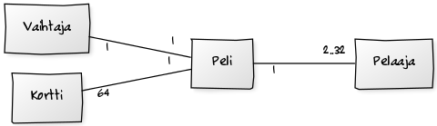
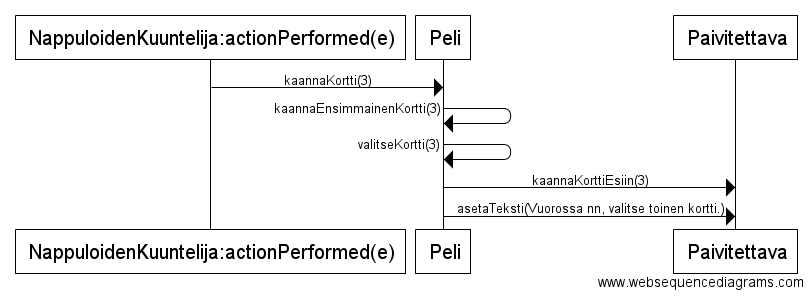
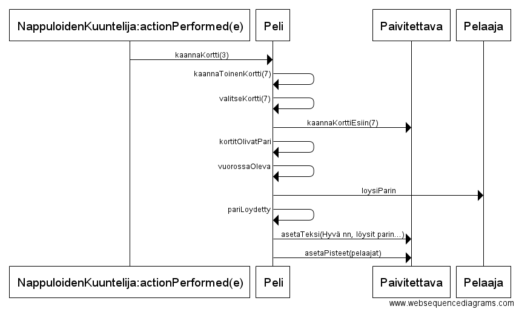

#**Aihe:** Kohtalaisen luotettava muistipeli

**Aihemäärittely**

Toteutetaan muistipeli, jossa lisää vaikeutta tuo satunnainen korttien paikan vaihtuminen. Peliä voi pelata 2 henkilöä ja korttien paikkajon vaihtaminen tapahtuu aina täyden kierroksen jälkeen.

Pelissä käytetään 32 korttiparia, jotka on järjestetty 8 x 8 ruudukkoon. Alustavasti suunnitelmana on käyttää korttien kuvitukseen ascii-merkkijonoa, mutta ajan salliessa myös grafiikan toteuttaminen voi tulla kyseeseen.

**Pelin säännöt**

Pelissä on yhteensä 64 korttia, jotka muodostavat 32 paria. Pelaaja valitsee vuorollaan kaksi korttia. Jos korttien kuvat vastaavat toisiaan, on pelaaja löytänyt parin ja saa yhden pisteen. Löydetyt parit poistetaan pelilaudalta. 

Kun jokainen pelaaja on saanut vuorollaan kääntää kortit, ennen kuin seuraava kierros alkaa, peli vaihtaa satunnaisesti kahden kortin paikkaa keskenään.Tämän jälkeen alkaa seuraava kierros. Tätä jatketaan kunnes kaikki kortit on löydetty. Pelin voittaa eniten pareja löytänyt pelaaja.

**Käyttäjät** 

* pelaaja

**Pelaajien toiminnot**
  * valitse kortti

**Luokkakaavio**

**Sekvenssikaaviot**

Pelaaja valitsee ensimmäisen kortin

Pelaaja valitsee toisen kortin ja löytää parin

