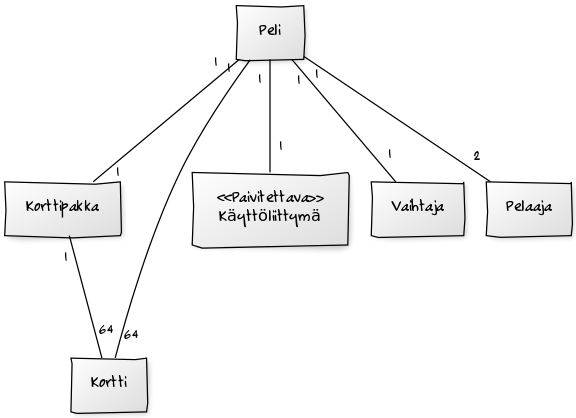
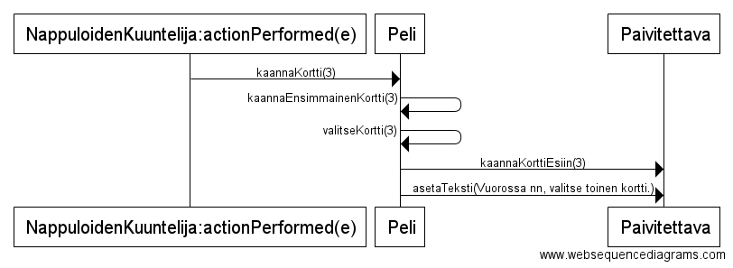

#**Aihe:** Kohtalaisen luotettava muistipeli

**Aihemäärittely**

Toteutetaan muistipeli, jossa lisää vaikeutta tuo satunnainen korttien paikan vaihtuminen. Peliä voi pelata 2 henkilöä ja korttien paikkojen vaihtaminen tapahtuu aina täyden kierroksen jälkeen.

Pelissä käytetään 32 korttiparia, jotka on järjestetty 8 x 8 ruudukkoon. Korttien kuvitukseen käytetään ascii-merkkejä.

**Rakennekuvaus**

Peli-luokka toteuttaa suurimman osan pelin toiminnallisuudesta. Pelaaja-luokan olioilla on nimi ja pisteet. Kortti-olioilla on tunnus, jota käytetään kortin tunnistamiseen. Korttipakka-luokka säilöö korttien merkit ja luo pelissä käytettävän pakan. Vaihtaja-luokka toteuttaa korttien vaihtamisen kierrosten välissä.

Käyttöliittymän tapahtumakuuntelija käyttää peli-luokan metodia välittääkseen löydetyn kortin sijainnin. Peli-luokka muuttaa rajapinnan kautta käyttöliittymän elementtejä pelitilannetta vastaavaksi.

**Käyttäjät** 

* pelaaja

**Pelaajien toiminnot**
  * valitse kortti

**Luokkakaavio**

**Sekvenssikaaviot**

Pelaaja valitsee ensimmäisen kortin

Pelaaja valitsee toisen kortin ja löytää parin

